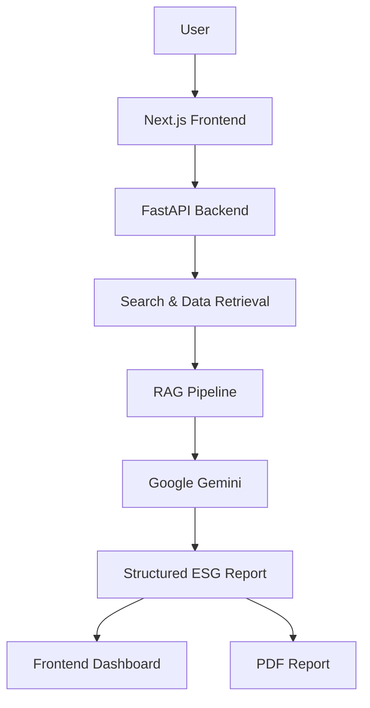
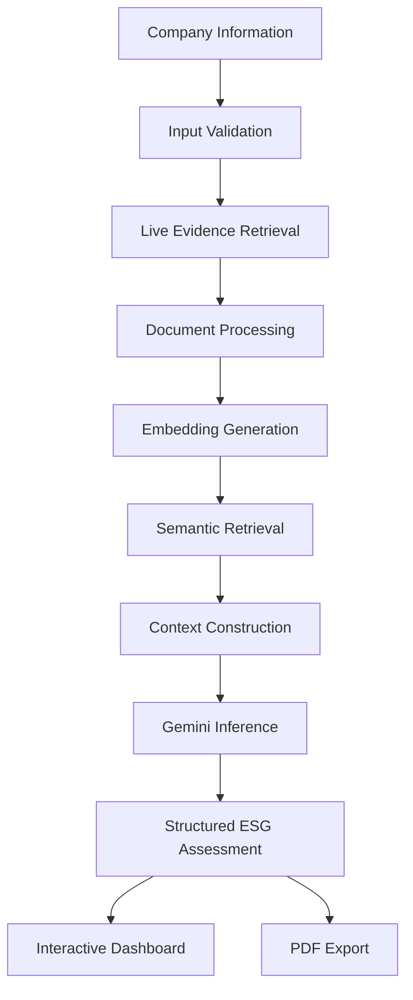

<p align="center">
  
</p>

<h1 align="center">ESG Prism</h1>

<p align="center">
  <strong>Enterprise AI Platform for Automated ESG Due Diligence</strong>
</p>

<p align="center">
Analyze publicly known companies using <strong>live web intelligence</strong>,
<strong>Retrieval-Augmented Generation (RAG)</strong>,
<strong>semantic search</strong>, and
<strong>Google Gemini</strong> to generate explainable ESG risk assessments in under 30 seconds.
</p>

<p align="center">


</p>

<p align="center">

<a href="https://esg-prism-tqqn.vercel.app">

</a>

<a href="https://youtu.be/YOUR_VIDEO_LINK">

</a>

<a href="https://esg-prism-backend.onrender.com/docs">

</a>

<a href="docs/architecture.md">

</a>

</p>

---

# Product Walkthrough

A complete walkthrough covering the end-to-end ESG due diligence workflow, including live evidence retrieval, Retrieval-Augmented Generation (RAG), AI-powered ESG scoring, structured report generation, and PDF export.

<p align="center">
<a href="https://youtu.be/a0k-ZxLk-1Y?si=ZzhGWXzT5RCQxEaE">

</a>
</p>

<p align="center">
<b>Click the thumbnail above to watch the complete project walkthrough.</b>
</p>

---

# Application Preview

<table>
<tr>
<td width="50%">

### Landing Experience

The application accepts a company name, company website, and optional ESG report to initiate an AI-powered due diligence analysis.


</td>

<td width="50%">

### Processing Pipeline

The backend retrieves live evidence, ranks relevant context, constructs RAG prompts, and generates structured ESG insights.


</td>
</tr>

<tr>
<td>

### ESG Assessment

Structured ESG scores are generated with supporting evidence, confidence indicators, risk categorization, and explainable reasoning.


</td>

<td>

### Exportable Reports

Every completed assessment can be exported as a professionally formatted PDF for compliance, auditing, and stakeholder review.


</td>
</tr>
</table>

---

# Table of Contents

- Overview
- Problem Statement
- Solution
- Core Capabilities
- System Architecture
- AI Analysis Pipeline
- Technology Stack
- Repository Structure
- Installation
- Environment Variables
- Roadmap
- Documentation
- Authors
- License

---

# Overview

ESG Prism is a full-stack AI platform that automates Environmental, Social, and Governance (ESG) due diligence using Retrieval-Augmented Generation (RAG), semantic search, and large language models.

Instead of relying solely on manual research or static sustainability reports, the platform gathers publicly available information, retrieves the most relevant evidence through semantic similarity, and generates structured ESG assessments grounded in verifiable context.

Designed for procurement teams, analysts, investors, and compliance professionals, ESG Prism delivers explainable ESG evaluations in seconds while maintaining transparency through evidence-backed reasoning.

---

# Problem Statement

Conducting ESG due diligence requires reviewing sustainability reports, annual filings, regulatory disclosures, and news coverage across numerous sources.

This manual process is often time-consuming, inconsistent, and difficult to scale when evaluating multiple organizations.

Additionally, conventional AI systems frequently generate generic summaries without grounding their responses in factual evidence, limiting trust and explainability.

---

# Solution

ESG Prism automates the complete due diligence workflow by combining live web intelligence with Retrieval-Augmented Generation.

For every analysis request, the platform retrieves relevant public information, ranks evidence using semantic similarity, enriches prompts with contextual knowledge, and generates structured ESG assessments using Google's Gemini models.

Every report is supported by retrieved evidence, enabling transparent, explainable, and repeatable ESG evaluations suitable for procurement, investment, and compliance workflows.

# Core Capabilities

<table>
<tr>
<td width="50%">

### Live Web Intelligence

Retrieves current information about target organizations from publicly available sources to ensure assessments are based on recent and relevant evidence rather than static reports.

</td>

<td width="50%">

### Retrieval-Augmented Generation

Constructs evidence-grounded prompts by combining semantic retrieval with Google's Gemini models, improving factual consistency and explainability.

</td>
</tr>

<tr>
<td>

### Structured ESG Assessment

Generates standardized Environmental, Social, and Governance evaluations with individual scores, overall risk ratings, and supporting justifications.

</td>

<td>

### Semantic Evidence Retrieval

Ranks retrieved content using embedding-based similarity to identify the most relevant information before inference.

</td>
</tr>

<tr>
<td>

### Explainable AI

Every assessment is accompanied by supporting evidence, source references, and reasoning to improve transparency and auditability.

</td>

<td>

### Professional Report Generation

Produces structured PDF reports suitable for procurement, investment analysis, compliance reviews, and stakeholder communication.

</td>
</tr>
</table>

---

# System Architecture

The platform follows a modular architecture where the frontend, backend, retrieval pipeline, and AI services operate as independent components.



---

# AI Analysis Pipeline

Each analysis request passes through multiple stages before a final ESG assessment is generated.



---

# Technology Stack

| Layer | Technologies |
|--------|--------------|
| Frontend | Next.js, React, TypeScript, Tailwind CSS |
| Backend | FastAPI, Python |
| AI | Google Gemini, Retrieval-Augmented Generation (RAG), Semantic Embeddings |
| Search | Live Web Search, Context Retrieval |
| Report Generation | PDF Generation |
| Deployment | Vercel, Render |
| Documentation | Swagger / OpenAPI |

---

# Repository Structure

```text
ESG-Prism/

├── backend/
│   ├── api/
│   ├── services/
│   ├── rag/
│   ├── prompts/
│   ├── models/
│   ├── utils/
│   └── main.py
│
├── frontend/
│   ├── app/
│   ├── components/
│   ├── hooks/
│   ├── lib/
│   └── public/
│
├── assets/
│
├── docs/
│   ├── architecture.md
│   ├── rag.md
│   ├── api.md
│   ├── engineering-decisions.md
│   ├── deployment.md
│   ├── security.md
│   ├── performance.md
│   └── testing.md
│
├── README.md
└── LICENSE
```

---

# Design Principles

The architecture is built around a small set of engineering principles:

- **Modularity** — Independent frontend, backend, and AI components simplify maintenance and future expansion.
- **Explainability** — ESG assessments are grounded in retrieved evidence rather than generated solely from model knowledge.
- **Separation of Concerns** — User interface, business logic, retrieval, and inference remain isolated within dedicated modules.
- **Scalability** — Individual services can evolve or be replaced without affecting the overall workflow.
- **Extensibility** — Additional retrieval strategies, AI models, or ESG frameworks can be integrated with minimal architectural changes.

---

# Documentation

Additional technical documentation is available within the `docs/` directory.

| Document | Description |
|----------|-------------|
| `architecture.md` | Overall system architecture and request lifecycle |
| `rag.md` | Retrieval-Augmented Generation pipeline |
| `api.md` | REST API documentation |
| `engineering-decisions.md` | Key architectural and implementation decisions |
| `deployment.md` | Deployment architecture and infrastructure |
| `security.md` | Authentication, validation, and security practices |
| `performance.md` | Performance characteristics and optimization strategies |
| `testing.md` | Testing approach and future automation |
