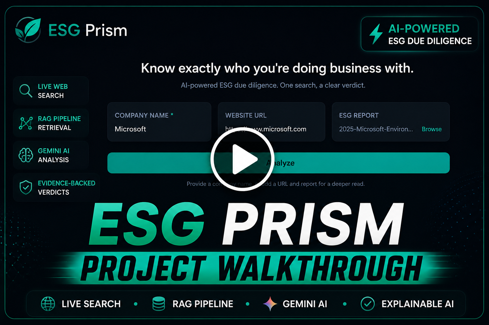
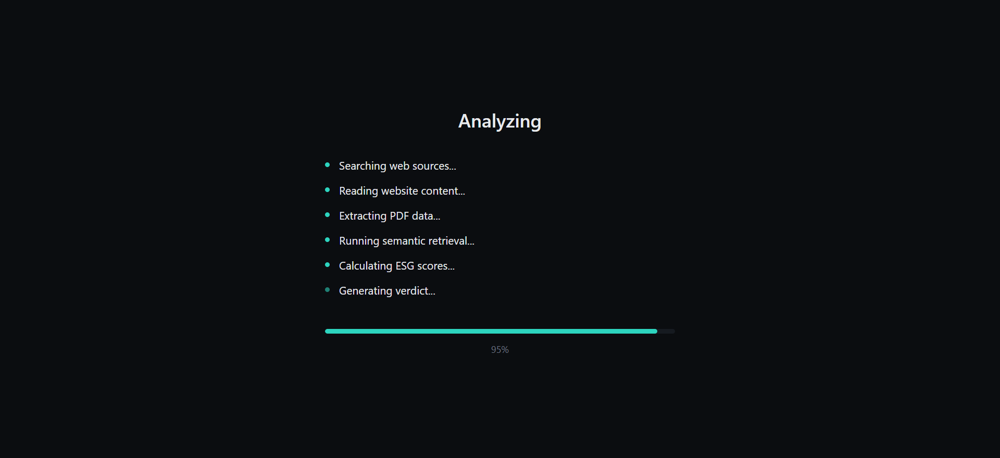

  

<h1 align="center">ESG Prism</h1>

  <strong>Enterprise AI Platform for Automated ESG Due Diligence</strong>

Analyze publicly known companies using <strong>live web intelligence</strong>,
<strong>Retrieval-Augmented Generation (RAG)</strong>,
<strong>semantic search</strong>, and
<strong>Google Gemini</strong> to generate explainable ESG risk assessments in under 30 seconds.

---

# Product Walkthrough

A complete walkthrough covering the end-to-end ESG due diligence workflow, including live evidence retrieval, Retrieval-Augmented Generation (RAG), AI-powered ESG scoring, structured report generation, and PDF export.

<b>Click the thumbnail above to watch the complete project walkthrough.</b>

---

# Application Preview

<table>
<tr>
<td width="50%">

### Landing Experience

The application accepts a company name, company website, and optional ESG report to initiate an AI-powered due diligence analysis.

</td>

<td width="50%">

### Processing Pipeline

The backend retrieves live evidence, ranks relevant context, constructs RAG prompts, and generates structured ESG insights.

</td>
</tr>

<tr>
<td>

### ESG Assessment

Structured ESG scores are generated with supporting evidence, confidence indicators, risk categorization, and explainable reasoning.

</td>

<td>

### Exportable Reports

Every completed assessment can be exported as a professionally formatted PDF for compliance, auditing, and stakeholder review.

</td>
</tr>
</table>

---

# Table of Contents

- Overview
- Problem Statement
- Solution
- Core Capabilities
- System Architecture
- AI Analysis Pipeline
- Technology Stack
- Repository Structure
- Installation
- Environment Variables
- Roadmap
- Documentation
- Authors
- License

---

# Overview

ESG Prism is a full-stack AI platform that automates Environmental, Social, and Governance (ESG) due diligence using Retrieval-Augmented Generation (RAG), semantic search, and large language models.

Instead of relying solely on manual research or static sustainability reports, the platform gathers publicly available information, retrieves the most relevant evidence through semantic similarity, and generates structured ESG assessments grounded in verifiable context.

Designed for procurement teams, analysts, investors, and compliance professionals, ESG Prism delivers explainable ESG evaluations in seconds while maintaining transparency through evidence-backed reasoning.

---

# Problem Statement

Conducting ESG due diligence requires reviewing sustainability reports, annual filings, regulatory disclosures, and news coverage across numerous sources.

This manual process is often time-consuming, inconsistent, and difficult to scale when evaluating multiple organizations.

Additionally, conventional AI systems frequently generate generic summaries without grounding their responses in factual evidence, limiting trust and explainability.

---

# Solution

ESG Prism automates the complete due diligence workflow by combining live web intelligence with Retrieval-Augmented Generation.

For every analysis request, the platform retrieves relevant public information, ranks evidence using semantic similarity, enriches prompts with contextual knowledge, and generates structured ESG assessments using Google's Gemini models.

Every report is supported by retrieved evidence, enabling transparent, explainable, and repeatable ESG evaluations suitable for procurement, investment, and compliance workflows.
