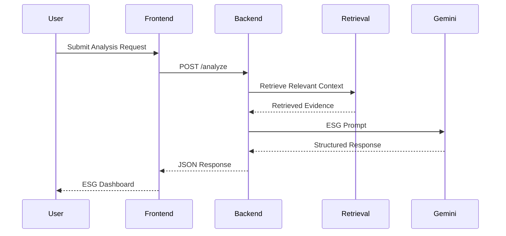
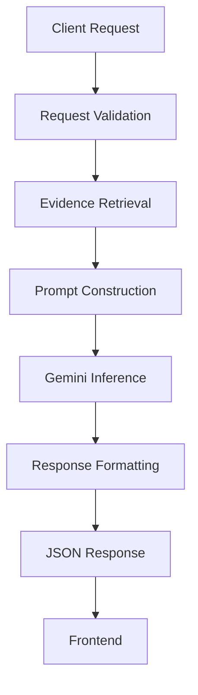

# API Documentation

## Overview

ESG Prism exposes a RESTful API that orchestrates the complete ESG due diligence workflow, from request validation and evidence retrieval to AI-powered ESG assessment and report generation.

The API follows REST principles and exchanges data exclusively in JSON format.

Interactive API documentation is automatically generated through OpenAPI and is available via Swagger UI.

---

# Base URL

Development

```
http://localhost:8000
```

Production

```
https://esg-prism-backend.onrender.com/
```

Swagger UI

```
/docs
```

OpenAPI Specification

```
/openapi.json
```

---

# API Characteristics

| Property | Value |
|----------|-------|
| Architecture | REST |
| Protocol | HTTPS |
| Payload Format | JSON |
| API Documentation | OpenAPI 3.1 |
| Response Encoding | UTF-8 |

---

# Request Lifecycle



---

# API Workflow



---

# HTTP Methods

| Method | Purpose |
|---------|----------|
| GET | Retrieve resources |
| POST | Submit analysis requests |

---

# Status Codes

| Code | Description |
|------|-------------|
| 200 | Request completed successfully |
| 400 | Invalid request |
| 404 | Resource not found |
| 422 | Validation error |
| 500 | Internal server error |

---

# Request Format

Example

```http
POST /analyze
Content-Type: application/json
```

```json
{
  "company_name": "Microsoft",
  "website": "https://www.microsoft.com",
  "report_url": ""
}
```

---

# Response Format

Successful responses return structured JSON.

Example

```json
{
  "company": "Microsoft",
  "overall_score": 82,
  "risk_level": "Low",
  "environmental": {},
  "social": {},
  "governance": {},
  "summary": "...",
  "recommendations": []
}
```

---

# Error Response

Example

```json
{
  "detail": "Unable to retrieve company information."
}
```

Validation example

```json
{
  "detail": [
    {
      "loc": [
        "body",
        "company_name"
      ],
      "msg": "field required",
      "type": "value_error.missing"
    }
  ]
}
```

---

# Core Endpoints

## Analyze Company

```
POST /analyze
```

Initiates the complete ESG due diligence workflow.

The request triggers:

- Input validation
- Live evidence retrieval
- Context construction
- Gemini inference
- Structured ESG report generation

---

## Health Check

```
GET /health
```

Returns the current health status of the backend service.

Example response

```json
{
  "status": "healthy"
}
```

---

## API Documentation

```
GET /docs
```

Provides interactive Swagger UI generated from the OpenAPI specification.

---

# Validation

Incoming requests are validated before processing.

Validation includes:

- Required fields
- Input types
- URL validation (where applicable)
- Empty request detection

Invalid requests return HTTP 422.

---

# Response Characteristics

Every successful response is designed to be:

- Structured
- Predictable
- Explainable
- Frontend-friendly

The response schema remains consistent regardless of the analyzed company.

---

# Error Handling

The backend returns structured errors for:

- Invalid requests
- Search failures
- AI inference failures
- Unexpected processing errors

This enables the frontend to provide meaningful feedback without exposing internal implementation details.

---

# Security Considerations

The API validates incoming requests and restricts access to configured origins.

Sensitive credentials such as API keys are stored using environment variables and are never exposed through API responses.

---

# Future API Enhancements

Potential improvements include:

- Authentication
- Rate limiting
- Request identifiers
- API versioning
- Streaming responses
- Batch company analysis
- Asynchronous processing
- Webhook support

---

# Related Documentation

| Document | Description |
|----------|-------------|
| `architecture.md` | Overall system architecture |
| `rag.md` | Retrieval-Augmented Generation pipeline |
| `engineering-decisions.md` | Design rationale |
| `deployment.md` | Deployment architecture |
