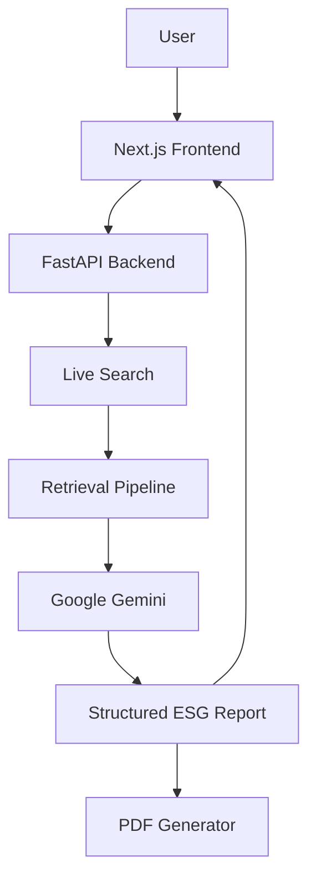
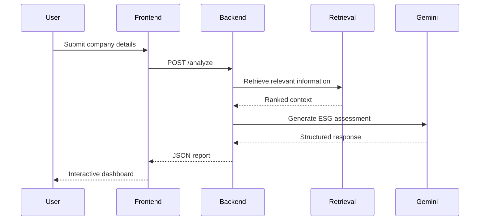
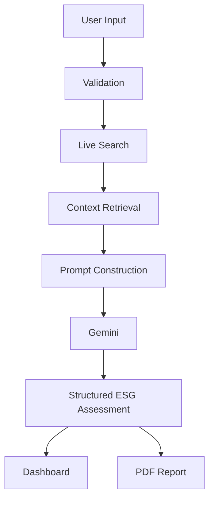

# System Architecture

## Overview

ESG Prism is a modular AI platform designed to automate Environmental, Social, and Governance (ESG) due diligence.

The application combines a modern web interface, a FastAPI backend, Retrieval-Augmented Generation (RAG), and Google's Gemini models to generate explainable ESG assessments from publicly available information.

The architecture separates presentation, orchestration, retrieval, inference, and report generation into independent components, enabling maintainability and future extensibility.

---

# High-Level Architecture



---

# System Components

## Frontend

Responsibilities

- User interaction
- Input validation
- Progress tracking
- Report visualization
- PDF download

The frontend communicates exclusively with the backend through REST APIs.

---

## Backend

Responsibilities

- Request validation
- Workflow orchestration
- Search coordination
- Prompt construction
- Response formatting
- Error handling

The backend acts as the central coordinator between external services and the frontend.

---

## Retrieval Layer

Responsibilities

- Gather relevant public information
- Process retrieved content
- Prepare contextual knowledge for inference

Rather than relying solely on model knowledge, retrieved information is incorporated into every analysis request.

---

## AI Inference Layer

Responsibilities

- Consume retrieved context
- Evaluate ESG criteria
- Produce structured analysis
- Generate explainable reasoning

Google Gemini performs the final ESG assessment using context prepared by the retrieval pipeline.

---

## Report Generation

Responsibilities

- Convert structured responses
- Format ESG sections
- Generate downloadable PDF reports

Reports preserve the same structure presented within the web interface.

---

# Request Lifecycle

Every company analysis follows the same processing pipeline.



---

# Data Flow



---

# Architectural Layers

```text
Presentation Layer

↓

Application Layer

↓

Retrieval Layer

↓

AI Inference Layer

↓

Output Layer
```

Each layer performs a dedicated responsibility while remaining independent of implementation details in adjacent layers.

---

# Component Responsibilities

| Component | Responsibility |
|-----------|----------------|
| Frontend | User interaction and visualization |
| Backend | Request orchestration |
| Retrieval | Context acquisition |
| AI Model | ESG reasoning |
| Report Generator | PDF generation |

---

# Design Principles

The architecture is guided by several engineering principles.

## Separation of Concerns

User interface, request orchestration, retrieval, inference, and report generation remain isolated.

---

## Modularity

Individual components can evolve independently without requiring major architectural changes.

---

## Explainability

Generated assessments are grounded in retrieved evidence rather than relying solely on model knowledge.

---

## Extensibility

Additional AI models, retrieval strategies, or reporting formats can be integrated with minimal impact on the overall architecture.

---

# Error Handling

The application validates every request before initiating analysis.

Potential failures include:

- Invalid company information
- Search failures
- AI inference errors
- Network interruptions
- Unexpected API responses

Errors are propagated through the backend as structured responses, allowing the frontend to provide meaningful feedback.

---

# Scalability Considerations

The current architecture supports moderate production workloads while remaining straightforward to deploy.

Future improvements may include:

- Background processing
- Distributed retrieval
- Caching
- Parallel search execution
- Multiple AI providers

---

# Related Documentation

For implementation-specific details, refer to:

| Document | Description |
|----------|-------------|
| `rag.md` | Retrieval-Augmented Generation workflow |
| `api.md` | REST API reference |
| `engineering-decisions.md` | Architectural rationale |
| `deployment.md` | Deployment architecture |
