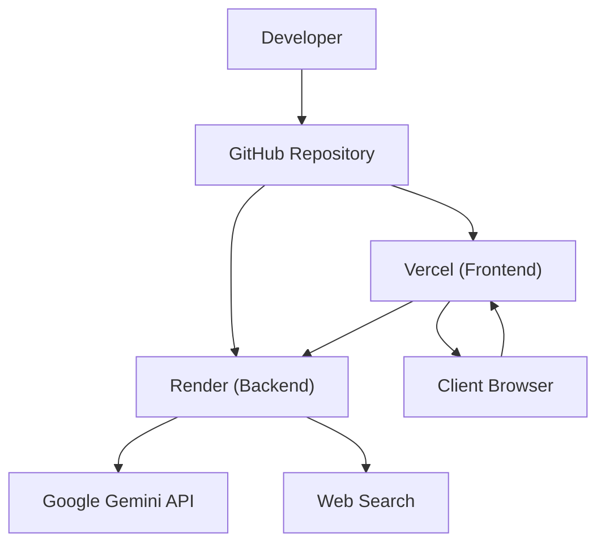
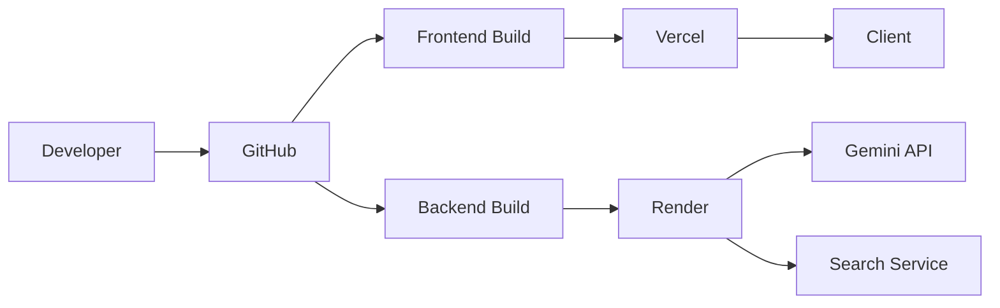
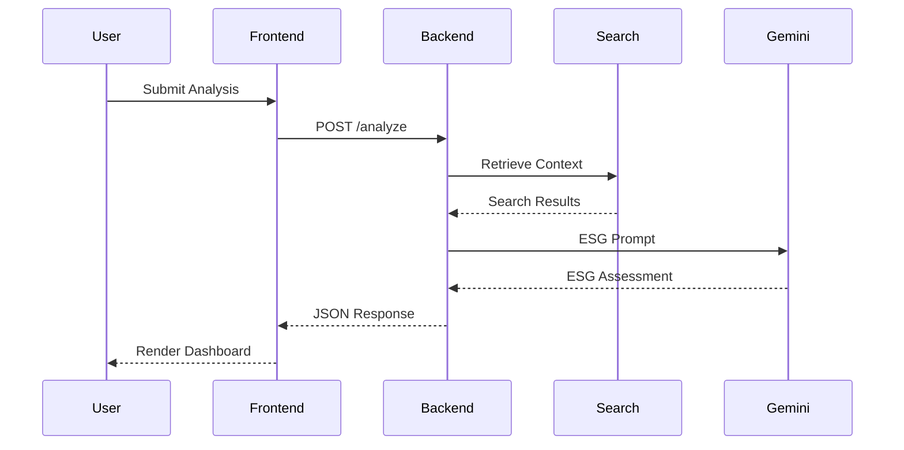

# Deployment

## Overview

ESG Prism is deployed as a distributed full-stack AI application with independently deployed frontend and backend services. The architecture separates user interaction, business logic, AI inference, and supporting services to simplify deployment, maintenance, and future scalability.

The deployment strategy allows each component to evolve independently while maintaining a clean and secure production environment.

---

# Deployment Architecture



---

# Infrastructure

| Component | Platform |
|-----------|----------|
| Frontend | Vercel |
| Backend | Render |
| AI Model | Google Gemini |
| Search | External Search Service |
| Version Control | GitHub |

---

# Deployment Topology

```text
Client Browser

↓

Next.js Frontend

↓

FastAPI Backend

↓

Search Retrieval

↓

Gemini API

↓

Structured ESG Report
```

---

# Frontend Deployment

The frontend is deployed independently and is responsible for:

- User interface
- Input validation
- Progress updates
- Result visualization
- PDF download

Production build

```bash
npm run build
```

Development server

```bash
npm run dev
```

---

# Backend Deployment

The backend exposes REST endpoints and orchestrates the AI workflow.

Responsibilities include:

- Request validation
- Retrieval pipeline
- Prompt construction
- Gemini inference
- Response formatting

Production server

```bash
uvicorn main:app
```

---

# AI Integration

The backend communicates with Google's Gemini API during every analysis request.

Responsibilities include:

- Prompt submission
- Structured response generation
- ESG reasoning
- Explainable analysis

API credentials are loaded from environment variables and are never stored in source code.

---

# Environment Configuration

Backend

```text
GOOGLE_API_KEY

SEARCH_API_KEY

ALLOWED_ORIGINS

SECRET_KEY
```

Frontend

```text
NEXT_PUBLIC_API_URL
```

Environment-specific configuration enables the same codebase to run consistently across development and production environments.

---

# Deployment Workflow



---

# Production Request Flow



---

# Runtime Dependencies

The application depends on:

- Google Gemini API
- Search provider
- Internet connectivity
- Environment configuration

Application startup does not require persistent storage.

---

# Health Checks

A healthy deployment satisfies the following conditions:

- Frontend accessible
- Backend reachable
- Gemini API available
- Search provider reachable
- API documentation accessible

---

# Failure Scenarios

| Failure | Impact |
|----------|--------|
| Gemini unavailable | ESG analysis cannot be completed |
| Search unavailable | Limited retrieval context |
| Invalid API keys | Backend startup or inference failure |
| Backend unavailable | Frontend cannot process requests |
| Network interruption | Analysis request fails |

---

# Recovery Strategy

Recovery involves:

- Verifying environment variables
- Restarting backend services
- Confirming AI service availability
- Validating search connectivity
- Redeploying the latest stable version if required

---

# Scalability Considerations

The current deployment is designed for moderate production workloads.

Future improvements may include:

- Request caching
- Background task processing
- Parallel retrieval
- Streaming responses
- Load balancing
- Multi-region deployment

---

# Monitoring

Recommended production metrics include:

- API latency
- Search latency
- Gemini inference time
- Request throughput
- Error rate
- Availability

---

# Security Considerations

Production deployments should enforce:

- HTTPS
- Secure environment variables
- Restricted API access
- Dependency updates
- Proper CORS configuration

---

# Future Improvements

Potential deployment enhancements include:

- Docker
- Docker Compose
- GitHub Actions
- Redis caching
- Automated health monitoring
- Blue-Green deployments

---

# Related Documentation

| Document | Description |
|----------|-------------|
| `architecture.md` | Overall system architecture |
| `rag.md` | Retrieval-Augmented Generation workflow |
| `api.md` | REST API reference |
| `engineering-decisions.md` | Design rationale |
