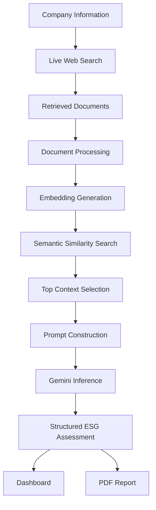
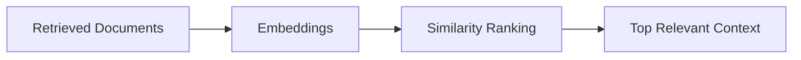
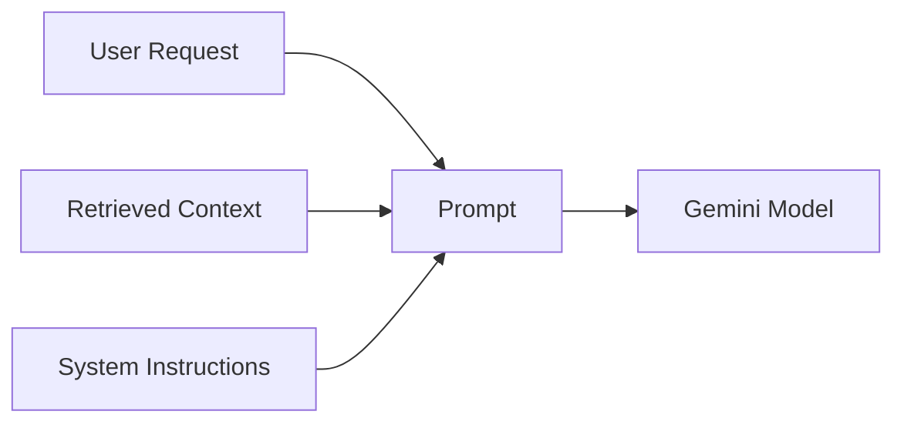

# Retrieval-Augmented Generation (RAG) Pipeline

## Overview

The Retrieval-Augmented Generation (RAG) pipeline is the core intelligence layer of ESG Prism.

Rather than relying exclusively on the language model's internal knowledge, the system retrieves relevant information from publicly available sources, constructs a contextual prompt, and generates ESG assessments grounded in retrieved evidence.

This approach improves factual consistency, transparency, and explainability while reducing hallucinations commonly associated with standalone language models.

---

# Pipeline Overview

---

# Pipeline Stages

## 1. User Input

The workflow begins when the user submits:

- Company name
- Company website (optional)
- ESG or Sustainability Report (optional)

These inputs define the scope of the analysis.

---

## 2. Live Evidence Retrieval

Relevant information is collected from publicly available sources.

Typical sources include:

- Company websites
- Sustainability reports
- ESG disclosures
- Regulatory filings
- Public news articles

The objective is to gather recent and relevant information before inference begins.

---

## 3. Document Processing

Retrieved documents undergo preprocessing before semantic retrieval.

Typical operations include:

- Text extraction
- Content cleaning
- Removal of irrelevant information
- Formatting for downstream processing

Only useful textual content proceeds to the retrieval stage.

---

## 4. Embedding Generation

Processed content is transformed into dense vector representations.

Embeddings capture semantic meaning rather than simple keyword frequency, enabling similarity search based on context instead of exact word matches.

---

## 5. Semantic Retrieval

Each embedding is compared to the user's query.

Documents are ranked according to semantic similarity.

Instead of providing every retrieved document to the language model, only the most relevant context is selected.

This improves both efficiency and response quality.

---

## 6. Context Construction

The retrieved evidence is merged into a structured context window.

The context supplied to the language model includes:

- Retrieved evidence
- ESG evaluation instructions
- Required response schema
- Company information

Only relevant information is forwarded to inference.

---

## 7. Prompt Construction

The final prompt consists of multiple components.

Prompt engineering ensures that generated responses remain structured, consistent, and aligned with ESG evaluation requirements.

---

## 8. AI Inference

Google Gemini performs the ESG assessment using:

- Retrieved evidence
- Structured instructions
- Company context

The model evaluates:

- Environmental practices
- Social responsibility
- Corporate governance
- Overall ESG risk

---

## 9. Structured Output

Instead of returning free-form text, the application generates structured output suitable for direct frontend rendering.

The response contains:

- ESG scores
- Risk classification
- Supporting evidence
- Strengths
- Weaknesses
- Recommendations
- Overall assessment

---

# Why Retrieval-Augmented Generation?

Traditional language models rely primarily on pre-trained knowledge.

This introduces several limitations:

- Outdated information
- Limited traceability
- Hallucinated facts
- Lack of source attribution

Retrieval-Augmented Generation addresses these limitations by incorporating external knowledge during inference.

Benefits include:

- Evidence-backed analysis
- More recent information
- Improved explainability
- Better factual consistency
- Increased user trust

---

# Explainability

Every generated assessment is supported by retrieved evidence.

Rather than producing unsupported conclusions, the system links recommendations and observations to the contextual information supplied during retrieval.

This enables users to understand how each ESG assessment was produced.

---

# Current Limitations

The current implementation assumes:

- Publicly accessible information
- Availability of relevant online sources
- Moderate document sizes
- Single-request processing

The quality of generated assessments depends on the quality and relevance of retrieved evidence.

---

# Future Improvements

Potential enhancements include:

- Hybrid retrieval strategies
- Multi-query retrieval
- Cross-encoder reranking
- Vector database integration
- Query expansion
- Context compression
- Citation-aware generation
- Streaming inference

---

# Summary

The Retrieval-Augmented Generation pipeline enables ESG Prism to combine live information retrieval with large language model reasoning.

By grounding every assessment in semantically retrieved evidence, the platform delivers explainable, structured, and context-aware ESG evaluations while maintaining flexibility for future improvements.
